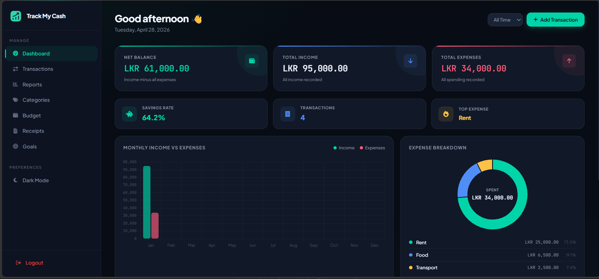
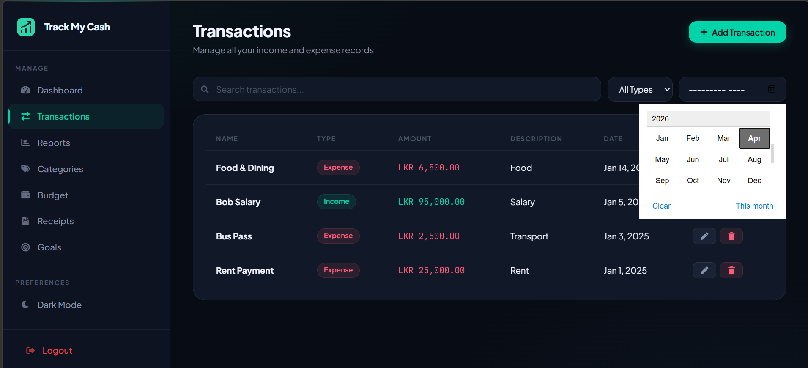
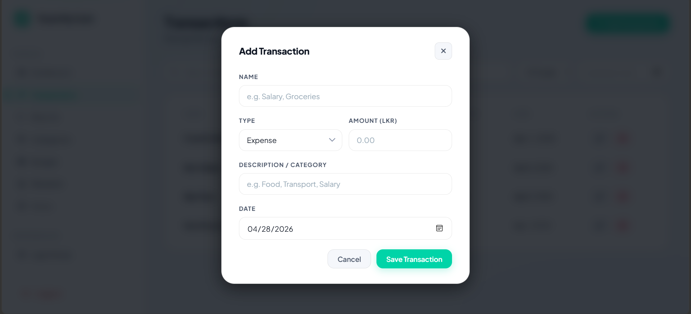
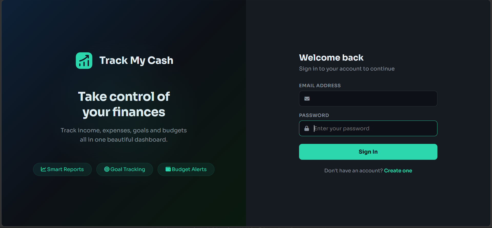
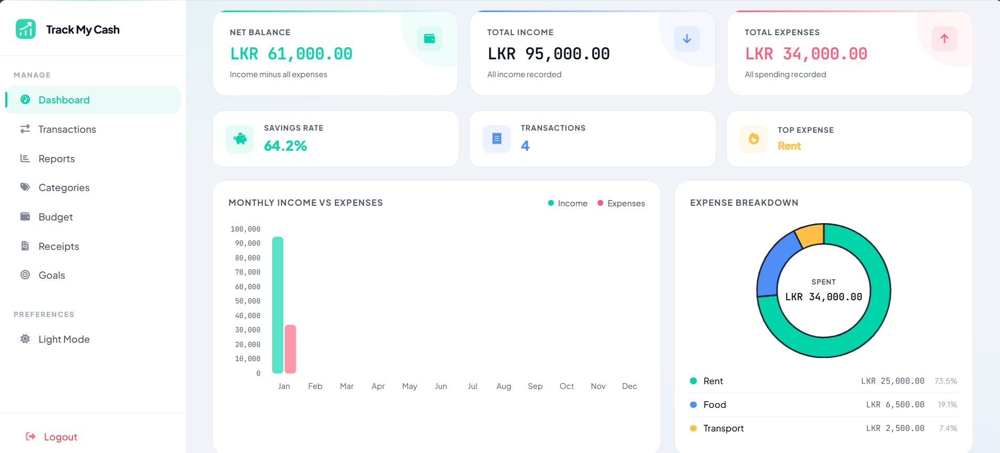

<div align="center">


### **PERSONAL FINANCE · FULL-STACK EXPENSE TRACKER**

*Secure by default. Clean by design. Built to last.*

<br/>


</div>

---

<br/>

## &nbsp; The Idea

Track My Cash is a smart and user-friendly expense tracking application designed to help individuals manage their daily finances with ease. The system allows users to record income and expenses, categorize transactions, monitor spending habits, and generate detailed financial reports. With features such as budget planning, transaction history, visual analytics, and secure data management, Track My Cash empowers users to take full control of their personal finances. Its intuitive interface ensures a seamless experience, making financial management simple, organized, and efficient for everyday users.

Built to explore what a Node + MySQL stack looks like when you stop cutting corners and start building something you'd actually use.

<br/>

---

<br/>

## &nbsp; Screenshots

<table>
<tr>
<td width="50%">

**01 — Dashboard**


</td>
<td width="50%">

**02 — Scroll Animation**


</td>
</tr>
<tr>
<td width="50%">

**03 — Features**


</td>
<td width="50%">

**04 — Gallery**


</td>
</tr>
<tr>
<td colspan="2">

**05 — Mobile**


</td>
</tr>
</table>

<br/>

---

<br/>

## &nbsp; What's New in v2.0

```
bcrypt Password Hashing    →  Plain-text passwords gone. Every hash salted properly.
Session Authentication     →  Stay logged in. express-session backed and signed.
Connection Pooling         →  mysql2 pool replaces the single fragile connection.
CSV Export                 →  Download your full report — one click, clean file.
Year Filter                →  Slice dashboard and reports by any year, instantly.
Inline Transaction Editing →  Edit without leaving the page. Was add-only before.
Goal Deadlines             →  Color-coded urgency. Red means act now.
Toast Notifications        →  alert() is gone. Every message is non-blocking.
Search + Filter            →  Find any transaction or receipt in seconds.
Dark / Light Mode          →  Toggle saved to localStorage per user.
Secure Uploads             →  Receipts land in public/uploads/, never the root.
.env Config                →  All secrets out of source code. Always.
```

<br/>

---

<br/>

## &nbsp; Tech Stack

| Layer | Choice | Why |
|---|---|---|
| **Runtime** | Node.js + Express | Fast, minimal, battle-tested |
| **Database** | MySQL2 + pooling | Reliable relational data, connection reuse |
| **Auth** | bcrypt + express-session | Industry-standard hashing, signed sessions |
| **Uploads** | Multer | Simple multipart handling for receipt images |
| **Dev** | Nodemon + dotenv | Hot reload + environment isolation |

<br/>

---

<br/>

## &nbsp; Get Running

```bash
# Clone
git clone https://github.com/yourusername/trackmycash.git
cd trackmycash

# Install
npm install

# Configure
cp .env.example .env
# Edit .env with your DB credentials and session secret

# Database
mysql -u root -p < schema.sql

# Start
npm start

# Development (auto-reload)
npm run dev
```

> Opens at `http://localhost:3000` — log in and start tracking.

<br/>

---

<br/>

## &nbsp; Environment Variables

```env
DB_HOST=localhost
DB_USER=root
DB_PASSWORD=yourpassword
DB_NAME=trackmycash
SESSION_SECRET=your-secret-key
PORT=3000
```

<br/>

---

<br/>

## &nbsp; Project Structure

```
TrackMyCash/
├── public/
│   ├── css/
│   │   └── main.css          # All shared styles
│   ├── uploads/              # Receipt images (auto-created)
│   ├── shared.js             # Sidebar, toast, helpers
│   ├── login.html
│   ├── register.html
│   ├── dashboard.html
│   ├── transaction.html
│   ├── goals.html
│   ├── budget.html
│   ├── category.html
│   ├── report.html
│   └── receipts.html
├── screenshots/              # README assets
├── server.js                 # Express backend
├── schema.sql                # Database schema
├── package.json
├── .env.example
└── README.md
```

<br/>

---

<br/>

## &nbsp; Security Philosophy

Security in v2.0 isn't a feature — it's the foundation.

Each decision was made with a clear goal:

- **Passwords** — bcrypt with proper salt rounds. Nothing stored reversible.
- **Sessions** — signed with a secret, stored server-side. No JWT shortcuts.
- **Uploads** — destination controlled, never user-defined. No path traversal.
- **Credentials** — `.env` only. Never committed, never hardcoded.

If it touches user data, it was treated seriously.

<br/>

---

<br/>

## &nbsp; Roadmap

- [ ] OAuth login (Google / GitHub)
- [ ] Monthly budget alerts via email
- [ ] Multi-currency support
- [ ] Data visualisation dashboard (charts)
- [ ] PWA support for mobile install

<br/>

---

<br/>

## &nbsp; License

MIT — use it, fork it, build on it.

<br/>

---

<div align="center">

*Designed and built with care*

<br/>

**TrackMyCash v2.0 — Personal Expense Tracker**

</div>
